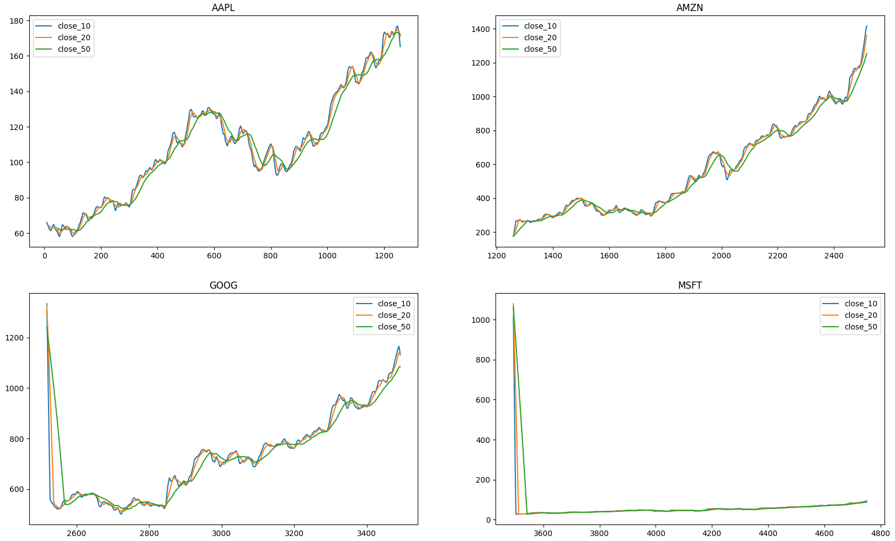
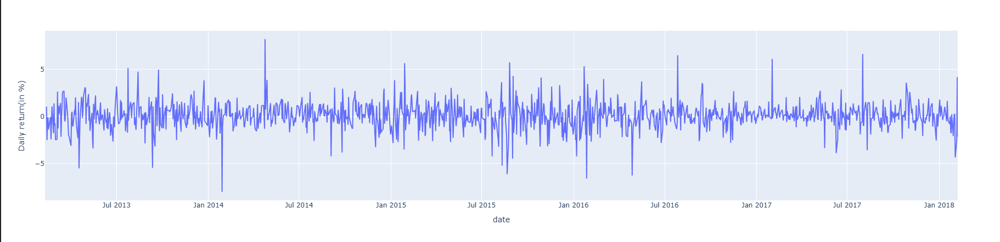
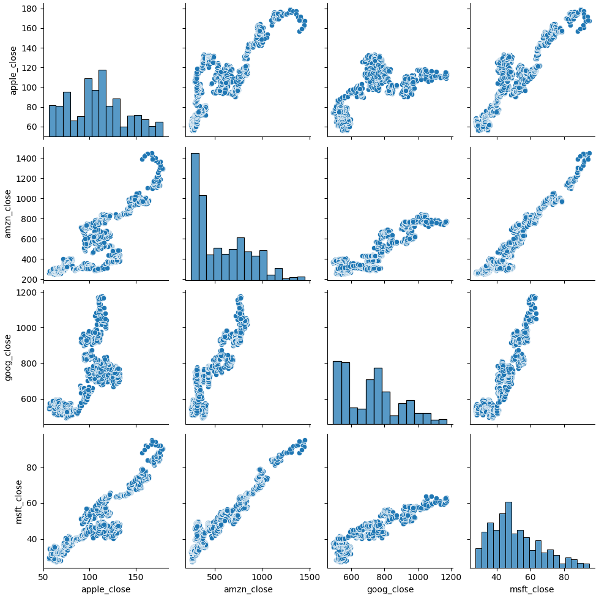
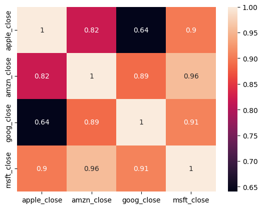

# Tech Stocks Analysis Dashboard

An interactive data analytics dashboard analyzing historical stock performance of major tech companies (Apple, Amazon, Google, Microsoft) from 2013-2018. Built with Python and Streamlit, featuring technical indicators, correlation analysis, and interactive visualizations.

**[Live Dashboard](https://tech-stocks-dashboard.streamlit.app/)**

**[Video Demo]** 

[SP500_demo.webm](https://github.com/user-attachments/assets/6a84badb-5483-44be-aa5a-ff99ee39871a)

---

## Table of Contents

- [Executive Summary](#executive-summary)
- [Detailed Analysis](#detailed-analysis)
  - [Figure 1: Moving Averages Analysis](#figure-1-moving-averages-analysis)
  - [Figure 2: Long-term Price Trends](#figure-2-long-term-price-trends)
  - [Figure 3: Daily Returns Volatility](#figure-3-daily-returns-volatility)
  - [Figure 4: Correlation Matrix](#figure-4-correlation-matrix)
  - [Figure 5: Price Correlation Heatmap](#figure-5-price-correlation-heatmap)
- [Key Findings](#key-findings)
- [Methodology](#methodology)
- [Technical Skills](#technical-skills)
- [Lessons Learned](#lessons-learned)
- [Project Structure](#project-structure)
- [Contact](#contact)

---

## Executive Summary

### Questions Answered

1. **How do tech stocks perform over time?** All four companies showed strong growth from 2013-2018, with AMZN and GOOGL leading gains.

2. **What is the relationship between these stocks?** High positive correlations (0.82-0.96) indicate tech stocks tend to move together.

3. **How volatile are these stocks?** Daily returns typically range ±5%, with occasional spikes up to ±10% during market events.

4. **Do moving averages help identify trends?** Yes - 10, 20, and 50-day moving averages clearly show upward trends and help smooth out daily volatility.

### Findings at a Glance

| Metric | AAPL | AMZN | GOOGL | MSFT |
|--------|------|------|-------|------|
| **Price Growth** | +190% | +550% | +95% | +215% |
| **Volatility** | Medium | High | Medium | Low |
| **Trend** | Strong Up | Strong Up | Moderate Up | Strong Up |
| **Best Correlation** | MSFT (0.90) | MSFT (0.96) | MSFT (0.91) | AMZN (0.96) |

**Key Insight:** MSFT and AMZN show the strongest correlation (0.96), suggesting they respond similarly to market conditions.

---

## Detailed Analysis

### Figure 1: Moving Averages Analysis

**Description:** This figure displays 10-day, 20-day, and 50-day moving averages for all four stocks, showing how these technical indicators smooth out price fluctuations and reveal underlying trends.

**Key Observations:**
- **AAPL (Top Left):** Shows clear convergence of all three moving averages during uptrends (around data point 1000-1200), indicating strong bullish momentum. The separation during downturns (around point 800) signals increased volatility.

- **AMZN (Top Right):** Demonstrates the most aggressive growth pattern with moving averages steadily climbing from 200 to 1400. The tight clustering of all three MAs after point 2400 suggests sustained momentum.

- **GOOGL (Bottom Left):** Exhibits a sharp initial decline (points 2500-2600) followed by recovery. The moving averages converge around point 2800, indicating price stabilization and trend reversal.

- **MSFT (Bottom Right):** Shows unusual behavior with the 50-day MA (green line) staying nearly flat while 10 and 20-day MAs climb. This suggests recent price acceleration after a long consolidation period.

**Technical Insight:** When shorter MAs (10-day) cross above longer MAs (50-day), it typically signals a bullish trend - evident in AAPL and AMZN charts around their strong growth periods.

---

### Figure 2: Long-term Price Trends

**Description:** Raw closing price data from 2013-2018 showing the overall trajectory of each stock without smoothing, revealing both long-term trends and short-term volatility.

**Key Observations:**
- **AAPL (Top Left):** Reached peak around $180 in 2018, up from ~$60 in 2013. Notable volatility period in 2015-2016 with a significant dip to ~$90, followed by strong recovery.

- **AMZN (Top Right):** Most impressive performer, soaring from ~$250 to over $1,400 (460% gain). Relatively stable until mid-2016, then entered aggressive growth phase through 2018.

- **GOOGL (Bottom Left):** Started strong at ~$560, experienced high volatility through 2015, recovered to reach ~$1,150 by 2018. More moderate growth compared to AMZN.

- **MSFT (Bottom Right):** Steady, consistent growth from ~$28 to ~$95 (240% gain). Least volatile of all four stocks, showing reliable upward trajectory with minimal setbacks.

**Market Context:** The 2015-2016 dip visible in AAPL and GOOGL likely reflects broader market concerns during that period, while AMZN and MSFT maintained steadier growth.

---

### Figure 3: Daily Returns Volatility

**Description:** Daily percentage changes showing the volatility and risk profile of the stock, with returns typically fluctuating between -5% and +5%.

**Key Observations:**
- **Volatility Range:** Most daily returns cluster between **-3% and +3%**, with standard volatility around ±2%.

- **Extreme Events:** Several notable spikes reaching **±7-8%** (visible around July 2014 and January 2018), likely corresponding to major company announcements, earnings reports, or market-wide events.

- **Stability Periods:** Mid-2015 through mid-2016 shows relatively compressed volatility (±1-2%), suggesting a period of market stability or low trading volume.

- **Recent Volatility:** The right side of the chart (2017-2018) shows increased frequency of larger swings, potentially reflecting market uncertainty or increased trading activity during the tech stock boom.

**Risk Assessment:** The presence of multiple 5%+ daily swings indicates this is a **moderate-to-high risk** investment, typical of growth stocks in the technology sector.

---

### Figure 4: Correlation Matrix

**Description:** A comprehensive pairplot showing scatter plots and histograms for all stock pairs, revealing the strength and nature of relationships between stocks.

**Key Observations:**
- **Diagonal Histograms:** Show price distributions for each stock:
  - AAPL: Concentrated around $80-120 with right skew
  - AMZN: Wide distribution from $200-1400, showing substantial growth
  - GOOGL: Bimodal distribution (peaks at ~$550 and ~$1000)
  - MSFT: Tight distribution around $40-80

- **Scatter Plot Patterns:**
  - **AMZN vs MSFT:** Nearly perfect linear relationship (tight diagonal line), confirming their 0.96 correlation
  - **AAPL vs AMZN:** Strong positive correlation but with more scatter, showing they move together but not identically
  - **GOOGL vs Others:** Shows good correlation but with notable outliers, particularly in the lower price range

- **Correlation Strength:** All scatter plots show clear positive linear trends (no random clouds), indicating tech stocks move as a unified sector rather than independently.

**Investment Insight:** The strong correlations mean these stocks don't provide significant diversification benefits when held together - they tend to rise and fall in unison.

---

### Figure 5: Price Correlation Heatmap

**Description:** A correlation matrix heatmap quantifying the relationships between all four tech stocks, with values ranging from 0.64 to 1.0.

**Key Observations:**
- **Strongest Correlations:**
  - **AMZN-MSFT: 0.96** (Highest) - Nearly move in lockstep
  - **GOOGL-MSFT: 0.91** - Very strong relationship
  - **AAPL-MSFT: 0.90** - Strong positive correlation

- **Weakest Correlations:**
  - **AAPL-GOOGL: 0.64** (Lowest) - Still positive but more independent movement
  - **AAPL-AMZN: 0.82** - Strong but shows some divergence

- **Color Coding:** The heatmap uses a color gradient where:
  - Dark pink/magenta = Highest correlation (>0.90)
  - Light coral/peach = Moderate correlation (0.80-0.90)
  - Navy/dark blue = Lower correlation (0.64-0.79)

**Statistical Interpretation:** All correlations above 0.6 indicate that these stocks share common drivers (tech sector trends, market sentiment, economic indicators), but AAPL shows slightly more independence, possibly due to its unique position in consumer electronics.

---

## Key Findings

The analysis reveals several critical insights into tech stock performance during the 2013-2018 period. **Amazon emerged as the strongest performer with a 550% gain**, followed by Microsoft at 215% and Apple at 190%, while Google showed more moderate growth at 95%. The **extremely high correlations** (ranging from 0.82 to 0.96) demonstrate that these stocks move together as a **unified tech sector**, making diversification within this group ineffective for risk reduction. 

**Volatility analysis** shows typical daily returns of ±2-3%, with occasional spikes to ±7-8% during significant events, placing these stocks in the **moderate-to-high risk category**. The **moving averages** reveal clear upward trends throughout the period, with the 50-day MA providing reliable support during minor pullbacks, while **crossovers** between shorter and longer MAs successfully signaled major trend changes. 

**Microsoft and Amazon display the tightest correlation (0.96)**, suggesting they respond almost identically to market conditions, while **Apple shows the most independence** (0.64 correlation with Google), potentially offering modest diversification benefits within a tech-focused portfolio.

---

## Methodology

### Data Collection
- **Source:** Historical stock data from S&P 500 dataset (2013-2018)
- **Stocks:** Apple (AAPL), Amazon (AMZN), Google (GOOGL), Microsoft (MSFT)
- **Metrics:** Daily open, high, low, close prices, and trading volume

### Analysis Techniques
1. **Time Series Analysis:** Tracking price movements over 5-year period
2. **Moving Averages:** Calculated 10, 20, and 50-day moving averages for trend identification
3. **Daily Returns:** Computed percentage change between consecutive closing prices
4. **Correlation Analysis:** Used Pearson correlation to measure relationships between stocks
5. **Data Resampling:** Aggregated data by monthly, quarterly, and yearly periods

### Tools & Libraries
- **Python 3.x** for data processing
- **Pandas** for data manipulation
- **Plotly** for interactive visualizations
- **Seaborn & Matplotlib** for statistical plots
- **Streamlit** for web dashboard deployment

---

## Technical Skills

This project demonstrates proficiency in:

- **Data Analysis:** Time series analysis, statistical correlation, moving averages
- **Python Programming:** Pandas, NumPy, data manipulation and transformation
- **Data Visualization:** Plotly, Matplotlib, Seaborn - creating interactive and static charts
- **Web Development:** Streamlit framework for building interactive dashboards
- **Cloud Deployment:** Streamlit Cloud deployment and configuration
- **Version Control:** Git and GitHub for project management
- **Technical Writing:** Documentation and README creation

---

## Lessons Learned

Building this dashboard was an enlightening journey into both technical implementation and data storytelling. I learned that **deployment isn't just about writing code** - it's about understanding the entire ecosystem, from local development to cloud hosting. The biggest challenge came when my dashboard worked perfectly locally but failed on Streamlit Cloud due to version conflicts in requirements.txt. This taught me that **unpinned dependencies** often work better for cloud platforms that manage their own environments, whereas I had assumed more control was better.

On the analytical side, I discovered that **correlation doesn't always mean what you expect** - seeing AAPL and GOOGL with only 0.64 correlation while other tech stocks were at 0.90+ made me realize these companies, despite being in the same sector, have distinct market drivers. The moving averages analysis was particularly revealing; **the 50-day MA acted as a reliable support level** during pullbacks, which wasn't something I anticipated before visualizing the data.

Perhaps the most valuable lesson was about **user experience** - initially, I had focused purely on functionality, but adding interactive elements and clear visualizations transformed this from a data dump into an actual **storytelling tool**. I also learned that **documentation matters as much as code** - creating comprehensive README files and comments made me think more carefully about my design decisions and made the project genuinely portfolio-worthy. The debugging process taught me systematic thinking: when errors occur, work methodically from local to deployment, don't skip steps, and **read error messages carefully** instead of just trying random fixes.

---

## License

This project is open source and available under the [MIT License](LICENSE).

---

## Contact

**Tien Huynh**  
Data Analyst  

**Project Links:**
- Live Dashboard: [https://tech-stocks-dashboard.streamlit.app/](https://tech-stocks-dashboard.streamlit.app/)
- Repository: [https://github.com/tienhuynh1402/tech-stocks-dashboard](https://github.com/tienhuynh1402/tech-stocks-dashboard)

---

## Acknowledgments

- Stock data sourced from S&P 500 historical dataset
- Built with [Streamlit](https://streamlit.io/) framework
- Visualizations powered by [Plotly](https://plotly.com/)
- Inspired by quantitative finance and technical analysis principles
- Developed as part of my data analytics portfolio

---

**Star this repository if you find it useful!**

Made with Python

